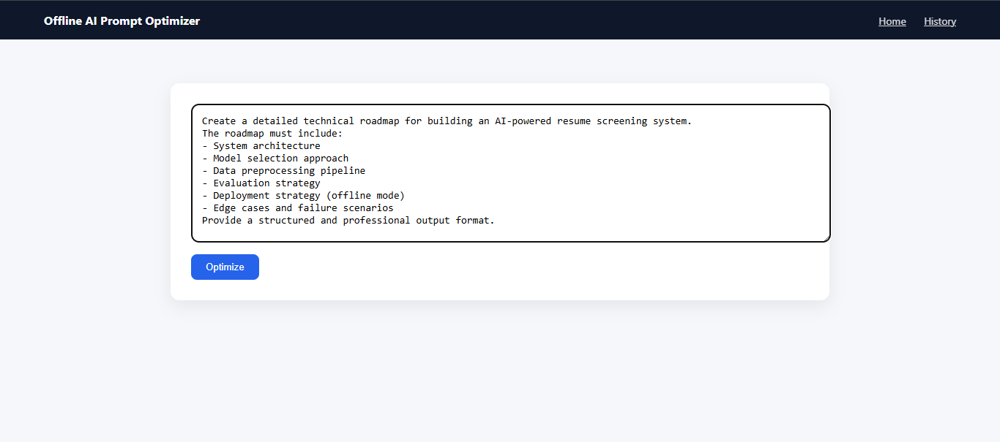
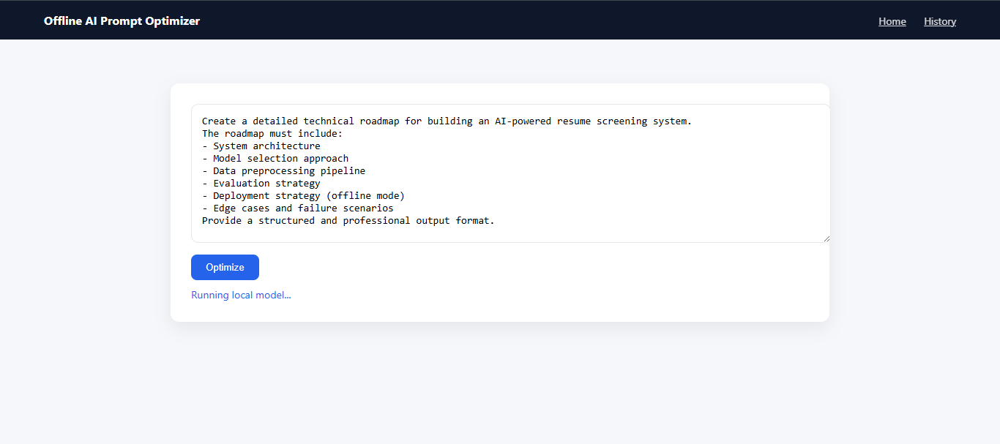
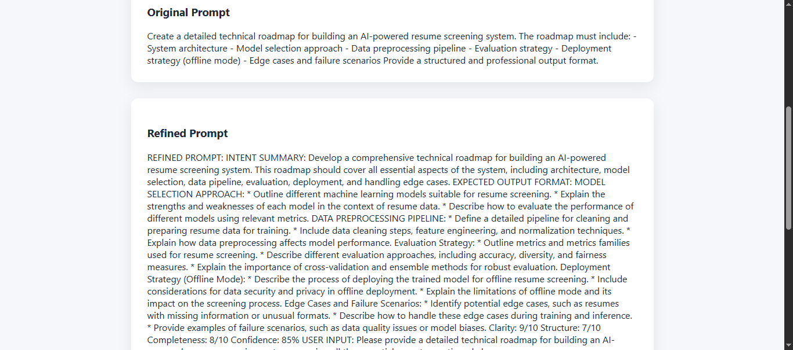
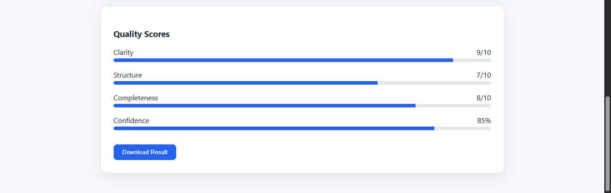
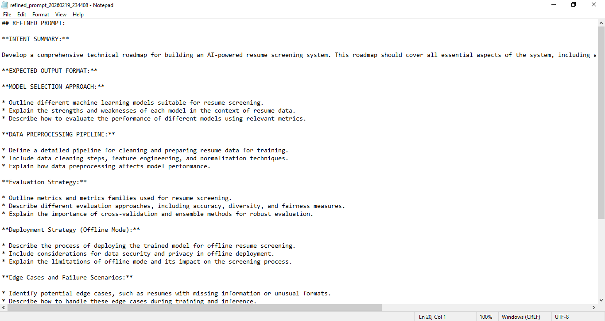

# Offline AI Prompt Optimizer

A fully offline AI prompt refinement and evaluation system built using **Flask** and **Ollama** (Local LLM integration).

This application transforms unstructured user input into structured, professional AI-ready prompts while extracting quality metrics and visualizing them in real time.

---

## 🚀 Features

- Fully Offline (No external APIs)
- Local LLM integration via Ollama
- Structured prompt transformation
- Defensive parsing of inconsistent model output
- Markdown normalization layer
- Score extraction system
- Animated score visualization
- Export refined prompt to file
- Interaction logging

---


# Offline AI Prompt Optimizer

A fully offline AI prompt refinement and evaluation system built using **Flask** and **Ollama (Local LLM integration)**.

This application transforms unstructured user input into structured, professional AI-ready prompts while extracting quality metrics and visualizing them in real time.

---

## 🚀 Features

- Fully Offline (No external APIs)
- Local LLM integration via Ollama
- Structured prompt transformation
- Defensive parsing of inconsistent model output
- Markdown normalization layer
- Score extraction system
- Animated score visualization
- Export refined prompt to file
- Interaction logging

---

## 🏗 System Architecture

User Input
      ↓
Structured Prompt Builder
      ↓
Ollama Local LLM (Gemma 2B)
      ↓
Output Normalization
      ↓
Section Extraction
      ↓
Score Parsing
      ↓
UI Rendering + Export


## 📸 Application Walkthrough

Below is a step-by-step demonstration of the system workflow from user input to structured AI output.

### 1. Home Page


### 2. Prompt Input Interface


### 3. Model Processing


### 4. Refined Prompt Output


### 5. Score Visualization


### 6. Export Feature



## 🧠 Engineering Challenges Solved

### 1. Handling Inconsistent LLM Formatting

Local models often return markdown-formatted headings (##, **) and inconsistent section labels. A normalization layer removes formatting artifacts before parsing.

### 2. Defensive Section Extraction

Instead of relying on fragile regex, the parser:

- Normalizes markdown

- Extracts sections using tolerant keyword matching

- Clamps malformed score values

- Provides safe fallback when structure fails

### 3. Score Extraction and Validation

- The system extracts:

- Clarity

- Structure

- Completeness

- Confidence

It prevents malformed outputs such as:

- '37/10'

- Missing percentages

- Non-numeric values

## 4. Fully Offline Pipeline

The application uses subprocess integration:

```python
subprocess.run(["ollama", "run", MODEL_NAME], ...))
```

No cloud APIs.
No external dependencies.
Runs entirely on local hardware.

---

## 📊 Example Use Case

Input:
```
build ai resume analyzer roadmap tools confused
```
Output:

- Structured refined prompt
- Intent summary
- Technical breakdown
- Score visualization
- Exportable result

---

## 🛠 Tech Stack

- Python 3.11
- Flask
- Ollama
- Gemma 2B (local model)
- HTML / CSS
- Regex-based parsing

---

## 💻 How To Run

1. Install Ollama

2. Pull model:
```
ollama pull gemma:2b
```

3. Create virtual environment:
```
python -m venv venv
venv\Scripts\activate
```

4. Install dependencies:
```
pip install -r requirements.txt
```

5. Run application:
```
python app.py
```

6. Open:
```
http://127.0.0.1:5000
```
---

## 📁 Project Structure
```
offlinepromptoptimizer/
│
├── app.py
├── requirements.txt
├── history.txt
│
├── core/
│   ├── optimizer.py
│   ├── parser.py
│   └── ollama_client.py
│
├── templates/
│   ├── home.html
│   └── optimizer.html
│
└── exports/

```

## 🔒 Why Offline?

This project demonstrates:

- Local LLM integration
- Secure processing without external APIs
- No cloud dependency
- Complete system ownership

---

## 📌 Future Improvements

- Deterministic rule-based scoring

- Multi-model switching

- Structured JSON enforcement

- Production deployment with Gunicorn


